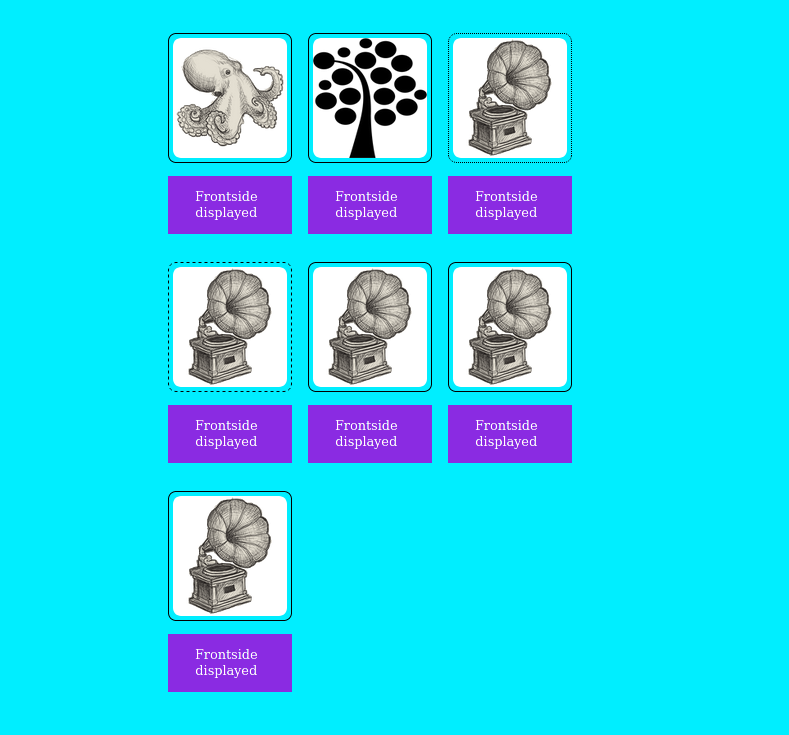

# &lt;flipping-tile&gt;

This is a web component simulating a flipping tile. It has a frontside and a backside
that can be flipped either by a mouse click event or by a keyboard event.

## Attributes

### `backimage`

A string containing the source to the backside image of the card.

Default value: "/images/lnu-symbol.png"

### `frontimage`

A string containing the source to the frontside image of the card.

Default value: "/images/2.png"

### `backalt`

A string containing the alt attribute of the backside of the card.

Default value: "Questionmark"

### `frontalt`

A string containing the alt attribute of the frontside of the card.

Default value: "Gramophone"

### `borderstyle`

A string displaying the borderstyle of the card.

Default value: "None"

## Methods

### `_flipCardAndDisplayCardSide()`

Either flips the card to the frontside or to the backside and also dispatches a new window event. This method also updates the text displaying which side is currently visibile.

## Events

| Event Name                   |  Fired When                                          |
| ---------------------------- | ---------------------------------------------------- |
| `flipCardAndDisplayCardSide` | A card is flipped and the current side is displayed. |

## Styling with CSS

Style is done with css the text where the different elements in template have parts that are used for selection within the attached css document.

